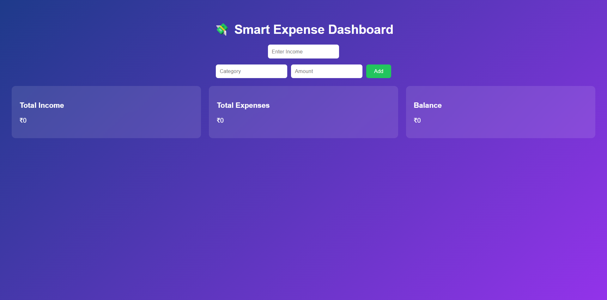
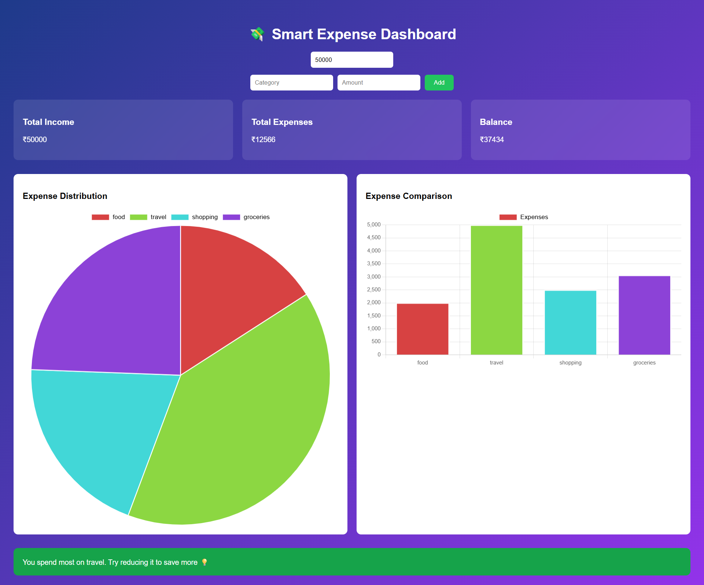

# 💸 Smart Expense Tracker

A full-stack **AI-powered Expense Tracking Web Application** that helps users track income, expenses, and get smart financial insights using interactive charts and a modern dashboard UI.

---

## 🚀 Live Features

- ➕ Add Income & Expenses dynamically
- 📊 Real-time expense tracking dashboard
- 📈 Pie Chart & Bar Chart visualization (Chart.js)
- 💰 Live calculation of Total Income, Expenses & Balance
- 🧠 Smart spending insights (AI-style logic)
- 🎨 Modern gradient UI with responsive design
- ⚡ Instant updates without page refresh

---

## 🛠 Tech Stack

### Frontend
- React.js
- Chart.js (react-chartjs-2)
- CSS (inline + modern UI styling)

### Backend
- Node.js
- Express.js
- MongoDB (Mongoose)

### Other Tools
- Axios (API calls)
- dotenv (environment variables)
- JWT Authentication (if enabled)

---

## 📁 Project Structure
Smart-Expense-Tracker/
├── client/ # React Frontend
├── server/ # Node + Express Backend
├── images/ # UI screenshots (for portfolio)
├── .gitignore
└── README.md


---

## ⚙️ Installation & Setup

### 1️⃣ Clone the repository

```bash
git clone https://github.com/your-username/smart-expense-tracker.git
cd smart-expense-tracker
```

### 2️⃣ Setup Backend
```
cd server
npm install
```
Create .env file:
```
PORT=5000
MONGO_URI=your_mongodb_connection_string
JWT_SECRET=your_secret_key
```

Run backend:
```
node server.js
```

### 3️⃣ Setup Frontend
```
cd client
npm install
npm start
```
---

## 📸 Screenshots
### 🏠 Dashboard


### 🧠 AI Insight


---

## ✨ Key Highlights
- Real-time financial tracking
- Clean and modern UI/UX
- Beginner-friendly but scalable architecture
- Portfolio-ready full-stack project
- Easy to extend with AI & analytics

---
### 🔥 Future Improvements
- 🔐 User authentication system (JWT + OAuth)
- ☁️ Cloud deployment (Render + Vercel)
- 🤖 OpenAI-powered financial insights
- 📱 Mobile app version (React Native)
- 📥 PDF report download feature

---
## 👨‍💻 Author

Nidhi Apotikar
